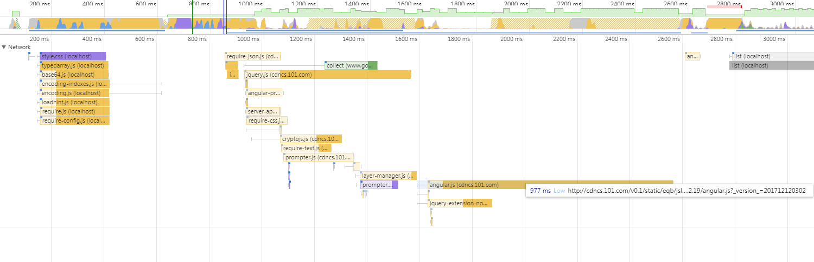

# 使用webpack重构简单多页应用入坑指南

## 为什么要重构

如果网站没有在3s内加载完毕，超过50%的人会选择跳出。随后每增加1s的时间，跳出率将会增加5.8%。访问需要重构的这个网站要花费7.97s。


## 雪崩时没有一片雪花是无辜的

重构之前，有必要对网站性能进行评估，对你的网站性能有一个大概的了解,一般来讲，加载时间过长这种问题常常不止一处。
通常情况下，可以使用Chrome开发者工具中的Network评估。如果你想了解的更详细，可以利用Chrome浏览器的Performance面板生成页面脚本的火焰图进行分析（在最新版本的Chrome中，Timeline已经改名为Performance）。也可以使用DevTools中的Audits工具进行分析。

### DevTools中的Performance工具


- 开发者工具 -> Performance面板 -> start profiling and reload page


Performance工具使用说明：

[Tools for Web Developers：如何使用 Performance 工具](https://developers.google.com/web/tools/chrome-devtools/evaluate-performance/timeline-tool?hl=zh-cn/)

[阮一峰：如何读懂火焰图](http://www.ruanyifeng.com/blog/2017/09/flame-graph.html)

### DevTools中的Lighthouse工具

Lighthouse 是一个开源的自动化工具，用于改进网络应用的质量。 您可以将其作为一个 Chrome 扩展程序运行，或从命令行运行,然后生成一个有关页面性能的报告。

- 开发者工具 -> Audits -> Perform an audit

自动生成分析报告，通过响应式、性能、兼容性、最佳实践四个维度对网站进行评分并给出解决方案。web


Lighthouse工具使用说明：

[Tools for Web Developers：使用 Lighthouse 审查网络应用](https://developers.google.com/web/tools/lighthouse/)

### 性能分析报告

根据Performance面板和和Audit工具得到的结论：

1. HTTP资源请求次数过多；加载展示型列表页面产生了40多个HTTP请求
1. CDN速度慢；加载jQuery使用了635ms,加载angular.js花费了977ms

1. JavaScript嵌套层次关系过深；这种情况会阻塞线程，延长加载时间


## 使用webpack进行简单的打包

webpack，一个强大的模块打包工具,在多页应用重构案中，重新划分了目录结构

并使用webpack构建模块，并进行必要的合并压缩去重。下面介绍一下我使用过的插件：

### 入口配置 entry参数

入口文件可以是一个也可以有多个,可以是单个文件也可以是一个数组：
```
entry: {
    questions_banks_main: './src/main/question_banks/main',
    knowledge_main: './src/main/knowledge/main',
    questions_main: './src/main/questions/main',
    knowledgeInfo_main: './src/main/knowledgeInfo/main'
}
```
稍微有些繁琐，精简一下代码：
```
var pageArr = [
    'question_banks',
    'knowledge',
    'questions',
    'knowledgeInfo'
];
var configEntry = {};
pageArr.forEach((page) => {
configEntry[page] = path.resolve(pagesDir, page + '/main');
});
```

### 出口配置 output参数
```
output: {
    path: path.resolve(__dirname, 'dist'),
    filename: '[name].[chunkhash].js'
}
```
[hash]和[chunkhash]这两个变量的用法：

用[hash]的话，由于每次使用 webpack 构建代码的时候，此 hash 字符串都会更新，因此相当于强制刷新浏览器缓存。
用[chunkhash]的话，则会根据具体 chunk 的内容来形成一个 hash 字符串来插入到文件名上；换句说， chunk 的内容不变，该 chunk 所对应生成出来的文件的文件名也不会变，由此，浏览器缓存便能得以继续利用。

### 生成模板 HtmlWebpackPlugin
四个入口文件需要分别打入四个文件当中，原项目使用的是angular1.2.x，每个页面有自己的DOM结构，所以除了打入JS文件之外也要将固定的模板输出到最终的结果当中。
```
// 生成一个新的HTML模板，将下列参数注入
new HtmlWebpackPlugin({
  // 位置
  inject: 'head',
  // 需要打包进html的js文件
  chunks: ['questions_banks_main'],
  // 需要打包的模板
  template: './src/main/question_banks/main.html',
  // 最终生成的结果
  filename: 'questions_banks.html'
}),
new HtmlWebpackPlugin({
  inject: 'body',
  chunks: ['knowledge_main'],
  template: './src/main/knowledge/index.html',
  filename: 'knowledge_main.html'
}),
new HtmlWebpackPlugin({
  inject: 'body',
  chunks: ['questions_main'],
  template: './src/main/questions/index.html',
  filename: 'questions_main.html'
}),
new HtmlWebpackPlugin({
  inject: 'body',
  chunks: ['knowledgeInfo_main'],
  template: './src/main/knowledgeInfo/index.html',
  filename: 'knowledgeInfo_main.html'
}),
```

### 配置别名 alias
别名（resolve.alias） 是 Webpack 的一个配置项，它的作用是把用户的一个请求重定向到另一个路径，例如通过修改 webpack.config.js配置文件，加入：
```
resolve: {
  alias: {
    moment: "moment/min/moment-with-locales.min.js"
  }
}
```
引用模块的时候可以直接通过
```
require('moment')
```
引用，经过验证通过别名的使用减少加载时间


### Webpack 中结合公用 CDN
```
externals: {
  jQuery: jQuery
}
```
在HTML模板中也要加上一行
```
<script src="https://cdn.bootcss.com/jquery/3.2.1/jquery.js"></script>
```
剥离出不需要打包的公共模块

### 将AMD模块改造为CommonJS规范支持的模块

改造方法较为简单
```
'dependency1'，’dependency2' 均是通过npm安装的模块
<!--AMD module-->
define(example,['dependency1'，’dependency2']，function('dependency1'，'dependency2'){
    // do Something
})

<!--CommonJS NodeJs规范-->
const dependency1 = require('dependency1')
const dependency1 = require('dependency2')
module.exports = function('dependency1'，'dependency2') {
    // doSomething
}

<!--ES2015规范 这种方法需要配置babel-->
import dependency1 = from 'dependency1'
import dependency1 = from 'dependency2'
exports default function('dependency1'，'dependency2') {
    // doSomething
}

```
参考阅读：
[寸志：模块化规范](https://www.zhihu.com/question/56820346)

### CommonsChunkPlugin 合并文件
多个 html共用一个js文件(chunk)

### CommonsChunkPlugin 合并公共代码
有些类库如utils, bootstrap之类的可能被多个页面共享，最好是可以合并成一个js，而非每个js单独去引用。这样能够节省一些空间。这时我们可以用到CommonsChunkPlugin，我们指定好生成文件的名字，以及想抽取哪些入口js文件的公共代码，webpack就会自动帮我们合并好
```
new webpack.optimize.CommonsChunkPlugin({
    name: "common",
    filename: "js/common.js",
    chunks: ['index', 'detail]
})
```

### TreeShaking
我们可以使用UglifyJsPlugin或者使用webpack内置插件webpack.optimize.DedupePlugin来对代码进行混淆、压缩、去重，此外wabpack官网还推荐了其他两种插件,有兴趣的可以去研究研究。
```
new UglifyJsPlugin()
<!-- webpack内置插件 -->
new webpack.optimize.DedupePlugin()
```

### CleanWebpackPlugin
使用webpack打包的时候，清除重复的dist文件夹中重复的文件
```
new CleanWebpackPlugin(['dist']),
```

# 结束
webpack中的许多插件职责并不单一，想要实现某一效果可以通过不止一种方式来实现。使用webpack配合功能强大的插件可以对代码进行一定程度上的优化
最终生成的dist文件：

